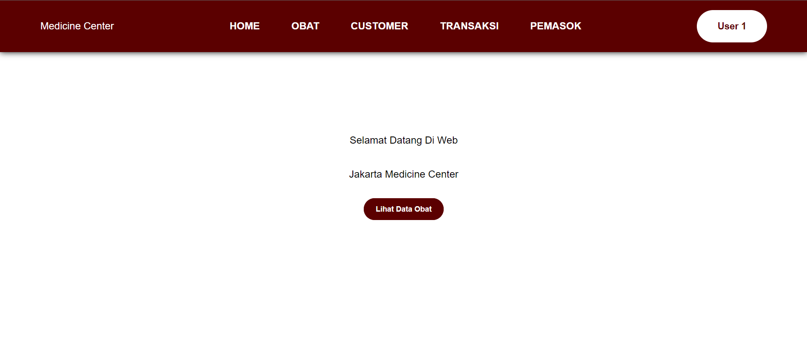
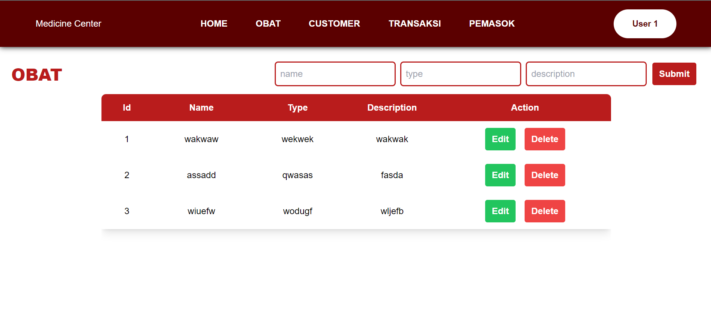
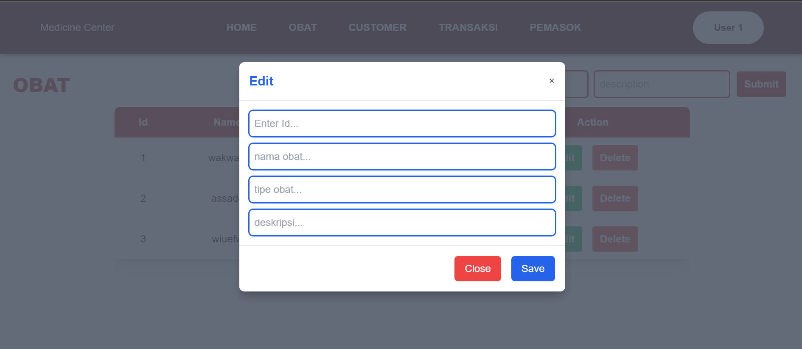
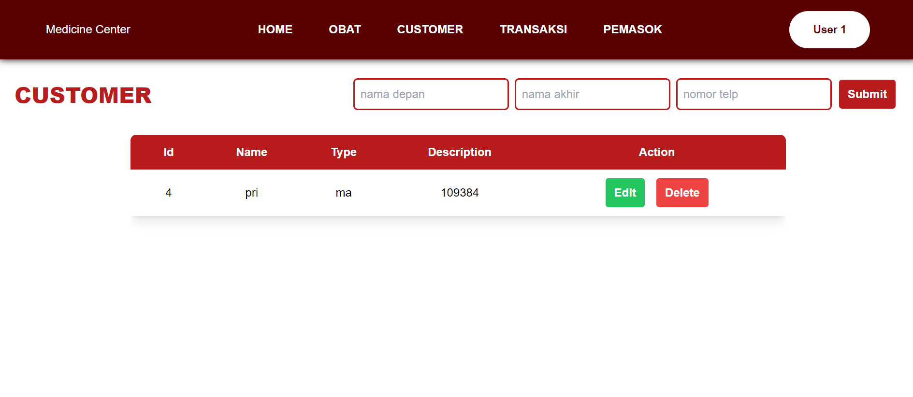

# PROJECT UTS FE
Disini saya membuat sebuah projek FE menggunakan React js, Express js, React Router Dom untuk melakukan routing, Axios untuk melakukan pengambilan data dan tailwind css untuk melakukan styling

## FITUR UTAMA
- React js sebagai library yang digunakan sebagai untuk mebangun interface yang dinamis dan interaktif
- Express.js adalah kerangka kerja backend minimalis untuk Node.js yang digunakan untuk membangun aplikasi web dan API. juga menjadi yang melayani permintaan front-end
- React Router DOM untuk routing pada aplikasi react. ini memungkinkan navigasi antar halaman tanpa melakukan reload pada suatu halaman
- Axios adalah pustaka untuk melakukan permintaan HTTP (GET, POST, PUT, DELETE) dari frontend ke backend atau API.
- Tailwind CSS adalah framework CSS berbasis utility-first yang memungkinkan pengembangan antarmuka dengan cepat menggunakan class yang sudah jadi.

## PREVIEW
#### 1. HALAMAN HOME

#### 2. TAMPILAN HALAMAN DATA

#### 3. TAMPILAN EDIT DATA OBAT

#### 4. TAMPILAN HALAMAN CUTOMER 
